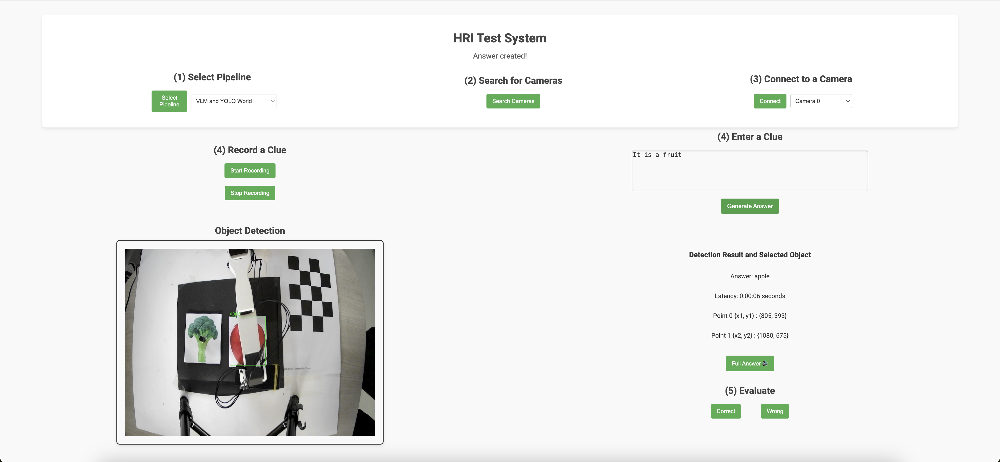
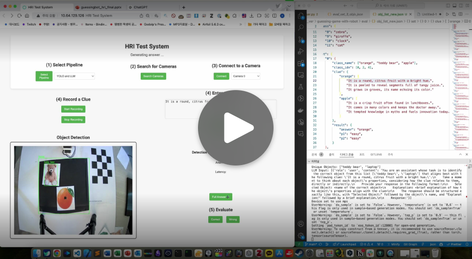
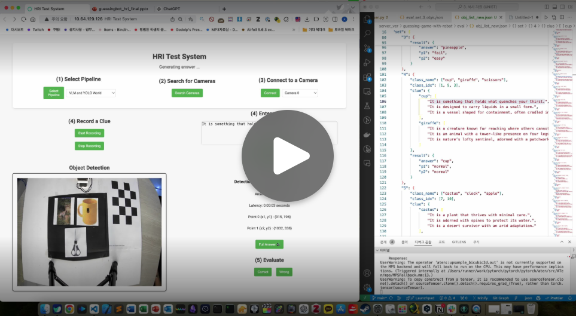

## Guessing Game with Robot Arm

#### Team
Eldor Fozilov, Gahyeon Shim, Minji Kim, Seongjae Lee, Sunhong Ahn, and Youngbin Ki

### Demonstration Video

### User Interface 
<!--  -->
<!--  -->

### User Interface Demo (Pipeline 1 & 2)

<table>
  <tr>
    <td>
      
    </td>
    <td>
      
    </td>
  </tr>
</table>

#### Environment Installation Guideline

conda create -n <name> python=3.10

`Installation Torch 2.1.2` [https://pytorch.org/get-started/previous-versions/]

MAC OSX : pip install torch==2.1.2 torchvision==0.16.2 torchaudio==2.1.2

Linux
Find your CUDA version first `nvcc --version`

> `CUDA 11.8` conda install pytorch==2.1.2 torchvision==0.16.2 torchaudio==2.1.2 pytorch-cuda=11.8 -c pytorch -c nvidia

> `CUDA 12.1` conda install pytorch==2.1.2 torchvision==0.16.2 torchaudio==2.1.2 pytorch-cuda=12.1 -c pytorch -c nvidia

Common Install

0) COMMON
- pip install openmim
- mim install "mmcv==2.1.0"
- mim install "mmdet==3.3.0"
- mim install "mmcv-lite==2.0.1"
- mim install "mmengine==0.10.4"
- mim install "mmyolo==0.6.0"

1) YOLO World
- git clone https://github.com/AILab-CVC/YOLO-World.git
- cd YOLO-World/
- pip install -e .
- cd ..

2) Lerobot
- git clone https://github.com/huggingface/lerobot.git
- cd lerobot
- pip install -e ".[dynamixel]"
- cd ..

3) TTS
- git clone https://github.com/coqui-ai/TTS.git
- cd TTS
- pip install -e .
- cd ..

(If it has a problem -> pip install TTS --use-deprecated=legacy-resolver)

4) COMMON
- pip install spacy timm accelerate sentencepiece
- pip install Flask-Assets
- pip install ultralytics openai-whisper pvrecorder
- pip install mujoco ikpy

#### Run

Server : `pyhton ./server/run_server.ipynb`

Client : `pyhton ./ui/run.py`
